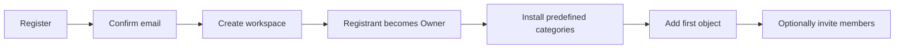

# Role and Plan Design Memo

## Purpose

ObjectTrack needs to support two product editions without splitting households and organizations into incompatible data models:

1. A Simple edition for households, collectors, clubs, and small businesses.
2. A Full edition for organizations that need formal administration and advanced object operations.

This memo records the product and authorization decisions that drove the
implementation. The design was implemented locally through Phase 7 acceptance
on 2026-08-13; staging and production rollout remain pending. The authoritative
implementation and rollout record is
[role_implementation_plan.md](role_implementation_plan.md).

## Core design principle

Keep these three concepts separate:

1. **Tenant edition or plan** controls product features, quotas, and commercial entitlements.
2. **User role** controls what a person may do inside a tenant.
3. **Object relationship and visibility scope** control which objects that person may see or act upon.

A plan is not a role. Terms such as `free user` or `consumer` should not become authorization roles. Likewise, a user being a tenant Owner does not mean that user is the current holder of every object.

Authorization should follow this rule:

```text
Allowed = role permission
          AND tenant-plan entitlement
          AND object visibility scope
```

## Platform-level role

### Platform Operator

A Platform Operator works across the ObjectTrack platform rather than within a single tenant. Platform operations include creating, inspecting, suspending, and supporting tenants and reading platform audit information.

Platform Operator membership is independent of tenant roles. A user may be both a Platform Operator and an Owner, Admin, Member, or Viewer in a particular tenant.

## One durable tenant model

Every household or organization should use the same underlying tenant model. The user-facing term should be **Workspace**, while `tenant` can remain the internal database term.

A workspace is the basic durable unit for users, objects, categories, invitations, and history. It should be able to grow without requiring data migration or the creation of a replacement tenant.

The initial editions should be:

```text
simple
full
```

Household, small business, club, collector, and similar classifications should be optional workspace labels used for onboarding and wording. They must not define authorization rules.

```text
workspace_kind: family | business | club | collector | other
```

Possible future paid tiers can exist within either edition. Capabilities should be represented through entitlements and quotas rather than scattered UI conditions.

| Capability | Simple edition | Full edition |
|---|---|---|
| Workspace creation | Self-service registration | Upgrade in place or formal onboarding |
| Initial user | Registrant becomes Owner | Existing Owner remains Owner |
| Roles | Owner and Member | Owner, Admin, Member, and Viewer |
| Categories | Fixed predefined categories | Predefined plus custom categories |
| Object limit | Small configurable quota | Plan-dependent quota |
| User limit | Small configurable quota | Plan-dependent quota |
| Invitations | Basic workspace invitations | Full user invitation and role workflow |
| Reports and audit | None or simplified activity | Full reports and tenant audit |
| Custom fields | None or limited | Available |
| Transfers | Simple handover | Full approval workflow |
| Groups | Not available | Available |
| Tenant settings | Basic workspace profile | Full organization profile |
| Billing and support | Free or inexpensive/self-service | Subscription-dependent |

Example plan entitlements:

```text
simple
  max_users = 5
  max_objects = 100
  custom_categories = false
  groups = false
  advanced_transfers = false
  reports = false
  audit_ui = false

full
  limits = subscription-dependent
  custom_categories = true
  groups = true
  advanced_transfers = true
  reports = true
  audit_ui = true
```

Exact quotas remain product decisions and should be configurable rather than embedded in application code.

### Upgrade in place

A Simple workspace must upgrade to Full without moving data:

```text
simple -> full
```

After upgrading:

- The existing Owner remains Owner.
- Existing Members remain Members.
- Users, objects, categories, events, invitations, history, and QR codes retain their identifiers.
- Admin, Viewer, groups, custom categories, reports, audit, and advanced transfer capabilities become available.
- Limits change according to the selected plan.

Downgrading requires validation. A workspace should only downgrade when it is within Simple quotas and no longer depends on Full-only features. Alternatively, Full-only data can become read-only until the workspace satisfies downgrade requirements.

## Business tenant roles

### Owner

The Owner is the accountable authority for one tenant. The role combines operational permissions with tenant governance.

Owner-only responsibilities are the governance core — how the workspace is
configured, what it costs, who holds authority, and the record of what happened:

- Managing tenant identity and core settings.
- Managing billing and plan selection.
- Granting or removing the Owner role.
- Protecting the tenant from losing its final Owner.
- Reading the tenant audit log.

The Owner also has the operational permissions of an Admin.

Amended 2026-08-14: group management and report generation were moved to Admin
because both are routine operations rather than governance. This narrowed the
Owner/Admin gap from six permissions to four. Audit access stayed Owner-only so
that an actor does not hold sole control of the record of its own actions, and
Owner-role management stayed Owner-only to preserve the last-authority
guarantee.

### Admin

An Admin is a delegated operational administrator. The desired Admin scope is intentionally narrower than the current implementation:

- Manage objects.
- Manage categories.
- Manage transfers.
- Invite users.
- Assign non-Owner roles where appropriate.
- Manage groups.
- Generate tenant reports.

An Admin should not automatically be able to:

- Change tenant ownership.
- Grant or remove the Owner role.
- Manage billing or subscription plans.
- Change governance-sensitive tenant settings.
- Read the tenant audit log.
- Read platform-wide information.

Tenant audit access remains Owner-only. It can become a separate delegated
permission later if business customers need it.

### Member or Custodian

A Member participates in object possession and transfers but does not administer the tenant. The role should not automatically provide access to every tenant object or the full tenant user directory.

Recommended capabilities:

- View objects assigned to the user.
- View the current holder of an object through a controlled lookup.
- Participate in transfers involving the user.
- View history relevant to accessible objects, subject to product requirements.

The product-facing name `Custodian` may better express responsibility for physical objects, while `Member` is more generic.

### Viewer

A Viewer is the lowest authenticated tenant role and is read-only.

Recommended capabilities:

- View objects currently assigned to the user.
- Look up minimal current-holder information for a specific object by ID or QR code.
- Optionally view ownership history for that specific object.

A Viewer should not have general access to object creation, editing, deletion, transfers, event entry, settings, reports, the user directory, or administration pages.

## Recommended business permission matrix

| Capability | Owner | Admin | Member/Custodian | Viewer |
|---|---:|---:|---:|---:|
| Manage tenant identity/settings | Yes | No | No | No |
| Manage billing/plan | Yes | No | No | No |
| Grant/remove Owner | Yes | No | No | No |
| Assign Admin/Member/Viewer | Yes | Yes | No | No |
| Invite users | Yes | Yes | No | No |
| Manage objects | Yes | Yes | Limited or no | No |
| Manage categories | Yes | Yes | No | No |
| Manage transfers | Yes | Yes | Participate | No |
| View all tenant objects | Yes | Yes | No by default | No |
| View assigned objects | Yes | Yes | Yes | Yes |
| Look up current holder | Yes | Yes | Yes | Yes |
| Generate reports | Yes | No initially | No | No |
| Read tenant audit | Yes | No initially | No | No |

## Simple-edition roles

The Simple edition should minimize role complexity. It initially needs only two roles:

| Role | Meaning |
|---|---|
| Owner | Creates and manages the workspace, membership, and all objects |
| Member | Views permitted objects and participates in simple handovers |

The UI may display friendly labels such as Family Owner or Workspace Owner based on `workspace_kind`, but these labels map to the same underlying role. An Adult/Manager role should be introduced only if users demonstrate a need for shared administration.

### Simple member visibility

The Owner should choose one workspace-wide visibility mode:

```text
private
  Members see only objects currently assigned to them.

shared
  Members can view all workspace objects but can modify or transfer only
  objects for which they have the permitted relationship.
```

This single setting supports both privacy-oriented households and collaborative small businesses without multiplying roles.

## Self-registration workflow

Simple registration should create a new workspace rather than waiting for an invitation. Full business onboarding may still use an invitation or platform-operated workflow.



A registrant must never be silently assigned to an existing workspace based on email address or email domain.

## Category model for Simple

Suggested predefined categories:

- Electronics
- Documents
- Tools
- Appliances
- Furniture
- Jewelry
- Collectibles
- Sports equipment
- Other

The recommended implementation is to copy category templates into each new Simple workspace and mark them as system-managed. This keeps tenant queries straightforward and preserves existing category labels when the global template changes later.

Suggested rules:

- Simple workspaces can use predefined categories but cannot create or delete categories.
- Full workspaces can fully manage categories.
- A future paid Simple plan may raise quotas without necessarily enabling every Full feature.

## Object visibility scopes

Role permissions alone are not sufficient. An authenticated user's data visibility should have an explicit scope:

```text
tenant    all objects within the tenant
group     objects associated with the user's group
assigned  only objects currently assigned to the user
lookup    no general list; minimal data for one scanned or entered object
```

Recommended defaults:

| Role | Default visibility |
|---|---|
| Owner | Tenant |
| Admin | Tenant |
| Member/Custodian | Simple visibility mode, or Assigned/Group in Full |
| Viewer | Assigned plus minimal lookup |
| Anonymous | QR-specific public information only when the tenant enables it |

The database must enforce these scopes with Row Level Security and controlled RPCs or security-invoker views. Hiding navigation items is not an authorization boundary.

## Ownership lookup

Viewer and Member users should not receive broad object or user-directory access merely to determine who holds an object. Provide a dedicated lookup by object ID or QR code that returns only approved fields, such as:

- Object identifier and display name.
- Current holder's display name.
- Optional group or location.
- Optional ownership history for that object.

The lookup should not expose unrelated objects, the complete tenant directory, sensitive custom fields, or private images unless explicitly authorized.

## Terminology

`Owner` currently has two possible meanings:

- Tenant Owner: the person who governs an account or organization.
- Object Owner: the person currently possessing or being responsible for an object.

To avoid confusion, the application should use `Current holder`, `Custodian`, `Assigned to`, or `In possession of` for the object relationship. `Current holder` is the recommended default.

The database column `current_owner_id` can remain temporarily for compatibility, while user-facing language changes to `Current holder`.

## Permission presets

The internal authorization model should use granular permissions bundled into fixed role presets. A full custom-role editor is not recommended for the first release.

Example permission direction:

```text
Owner
  tenant.manage
  billing.manage
  owners.manage
  users.manage
  invitations.manage
  objects.manage
  categories.manage
  transfers.manage
  reports.read
  audit.read

Admin
  invitations.manage
  users.assign_non_owner_roles
  objects.manage
  categories.manage
  transfers.manage

Member
  objects.read_assigned
  transfers.participate
  ownership.lookup

Viewer
  objects.read_assigned
  ownership.lookup
```

The implemented permission names live in\n[`src/lib/auth/permissions.ts`](../src/lib/auth/permissions.ts). Their scope is enforced consistently in server actions, RPCs, RLS policies, routes, and navigation.

## First-release implementation

1. Use one durable workspace/tenant model for every customer type.
2. Add `edition` with `simple` and `full` values.
3. Add an optional, non-authoritative `workspace_kind` for family, business, club, collector, or other.
4. Give Simple workspaces only Owner and Member roles.
5. Add a Simple visibility setting with Private and Shared modes.
6. Add self-registration that creates a Simple workspace and makes the registrant Owner.
7. Install fixed categories and enforce configurable Simple user and object quotas.
8. Allow upgrade from Simple to Full in place without changing identifiers or moving data.
9. Restrict Full Admin to object, category, transfer, invitation, and supported non-Owner role management.
10. Support Owner, Admin, Member, and Viewer roles in Full.
11. Replace object-level `Owner` wording with `Current holder` throughout the UI.
12. Enforce every data boundary in Supabase RLS and controlled database functions, not only in frontend navigation.

## Deferred product decisions

The following product questions remain beyond the first release:

- Whether the business-facing `Member` role should be renamed `Custodian`.
- Whether Simple eventually needs an Adult/Manager role.
- Rules for downgrading from Full to Simple when Full-only data exists.
- Whether a paid Simple plan should increase only quotas or also unlock selected features.

