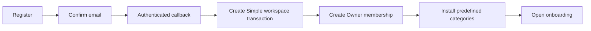

# Role and Edition Implementation Plan

## Overall status

All phases 0-7 are complete. Phase 7 passed local database, application, and
browser acceptance on 2026-08-13, then hosted staging, production schema, and
production feature-enable verification on 2026-08-14. A paid Supabase staging
branch was not required: the restored free `ObjectTrack-stage` project served as
disposable hosted staging. Self-service registration is now enabled in
production, and it remains safe by default elsewhere because
`SELF_SERVICE_REGISTRATION_ENABLED` is disabled when absent or set to `false`.

## Objective

Extend the existing ObjectTrack tenant model to support Simple and Full editions without migrating tenant data or replacing the current application architecture.

The implementation must deliver:

- Self-service Simple workspace registration.
- Configurable Simple limits and predefined categories.
- Private or shared Simple member visibility.
- Full-edition Owner, Admin, Member, and Viewer roles.
- A narrower Admin role and Owner-only governance capabilities.
- In-place upgrades from Simple to Full.
- Database-enforced authorization and tenant isolation.

This plan implements the direction in [role_design_memo.md](role_design_memo.md).

## Current foundation

The application already provides the main foundation required for this work:

- A durable `tenants` table and tenant-owned records.
- One tenant membership per user through `user_profiles`.
- Owner, Admin, and Member roles.
- Central permission helpers and database Row Level Security (RLS).
- Transactional tenant provisioning and versioned defaults.
- Secure invitations and invitation-first registration.
- Tenant administration, reports, audit records, and platform operations.
- Transfer workflows and object-holder relationships.

The work should therefore use additive migrations and incremental policy changes. It should not create separate household and business schemas or duplicate the application.

## First-release decisions

These defaults make the plan executable. They remain configurable product policy rather than permanent architectural constraints.

| Decision | First-release choice |
|---|---|
| Existing tenant edition | Backfill as `full` to preserve current behavior |
| Self-registered tenant edition | `simple` |
| Simple roles | Owner and Member only |
| Full roles | Owner, Admin, Member, and Viewer |
| Simple default visibility | `private` |
| Simple user limit | 5 active members, including Owners |
| Simple object limit | 100 non-deleted objects |
| Simple categories | Versioned predefined tenant-local categories |
| Initial upgrade authority | Platform Operator; billing integration can replace this later |
| Downgrade | Not exposed in the first-release UI |
| Existing Admin report/audit access | Removed when the new permission model is activated |
| Multi-workspace membership | Out of scope; preserve the current one-workspace-per-user model |

## Target authorization rule

Every protected operation should evaluate all applicable dimensions:

```text
Allowed = tenant membership
          AND role permission
          AND edition entitlement
          AND resource visibility or relationship
          AND tenant status
```

Frontend navigation may reflect these rules, but RPCs, server actions, API routes, storage policies, and RLS remain authoritative.

## Delivery phases

### Phase 0: Baseline and safety net

Status: **Complete (2026-08-13).** The pre-edition authorization contract is
documented in [role_phase0_baseline.md](role_phase0_baseline.md), and
`verify_role_edition_baseline.sql` adds explicit Owner, Admin, Member, and
Platform Operator fixtures. No production schema or remote database was
changed.

Establish a regression baseline before changing production authorization.

Tasks:

- [x] Record the current role, permission, route, RPC, table, and storage-policy matrix.
- [x] Add fixtures for existing Full Owners, Admins, Members, and Platform Operators.
- [x] Preserve the existing cross-tenant, forged-tenant-ID, invitation, report, audit, and transfer verification suites.
- [x] Define the Phase 1 migration assertion that every existing tenant receives the `full` edition.
- [x] Confirm that current IDs and foreign-key relationships remain unchanged.

Exit criteria:

- [x] The clean local migration reset, all eight SQL verification suites,
  TypeScript check, i18n check, database lint, database advisors, and production
  build pass before feature work begins.
- [x] The expected behavior that will intentionally change is listed separately
  from regressions.

Verification record (2026-08-13):

- Supabase CLI `2.114.0`; clean local reset applied the complete migration
  chain and seed successfully.
- All existing rollback-only suites and
  `verify_role_edition_baseline.sql` passed.
- `supabase db lint --local --level warning --fail-on error`: no schema
  errors.
- `supabase db advisors --local --type all --level warn --fail-on error`: no
  issues.
- `npm run i18n:check`: 766 messages match.
- `npx tsc --noEmit`: passed.
- `npm run build`: passed with 39 generated application routes.

### Phase 1: Add edition and workspace metadata

Status: **Complete (2026-08-13).** Migration
`20260813193842_phase1_edition_workspace_metadata.sql` adds the durable
edition model, private entitlement catalog, protected context functions, and
product-configuration audit coverage. Existing tenants are backfilled as Full;
no remote database was changed.

Add product classification without altering tenant identity.

Database changes:

- [x] Add `tenant.edition` constrained to `simple | full`, initially
  defaulting and backfilling to `full`.
- [x] Add nullable `tenant.workspace_kind` constrained to
  `family | business | club | collector | other`.
- [x] Add `tenant.member_visibility` constrained to `private | shared`; use
  `private` for new Simple workspaces.
- [x] Add an edition-entitlement source in the private schema, including user
  and object quotas and feature flags.
- [x] Add trusted helpers `current_tenant_edition()`,
  `has_tenant_entitlement()`, and `current_tenant_product_context()`.
- [x] Include edition, workspace kind, visibility, limits, and feature flags in
  the protected tenant-profile RPC.
- [x] Audit edition, workspace-kind, and visibility changes.

Application changes:

- [x] Extend generated database types and tenant-context types.
- [x] Make server-side authorization context expose validated edition,
  workspace, status, visibility, and entitlement values.
- [x] Derive edition, quota, and entitlement values from protected database
  context rather than browser input.

Compatibility rule:

- [x] Existing tenants remain Full and retain their current behavior throughout
  this phase.

Exit criteria:

- [x] Every tenant has a valid edition.
- [x] `workspace_kind` has no effect on authorization.
- [x] Entitlement helpers reject cross-tenant checks and return no active
  entitlements for suspended tenants.

Verification record (2026-08-13):

- Clean local reset applied the complete migration chain and seed.
- All nine rollback-only SQL suites passed, including
  `verify_phase1_edition_metadata.sql`.
- The new suite verifies Full backfill/defaults, Simple limits, Full feature
  flags, cross-tenant denial, suspended-tenant denial, non-authoritative
  workspace kind, protected edition updates, audit records, and anonymous RPC
  denial.
- Database lint found no schema errors; security/performance advisors found no
  issues; local migration history is synchronized through
  `20260813193842`.
- Generated TypeScript database types, `npx tsc --noEmit`,
  `npm run i18n:check` (766 messages), and `npm run build` (39 routes)
  passed.

### Phase 2: Refine roles and permissions

Status: **Complete (2026-08-13).** The staged catalog and activation migrations
add Viewer, replace broad data authorization with resource permissions, narrow
Admin to operational management, keep governance Owner-only, and enforce the
Simple/Full role boundary. No remote database was changed.

Replace broad Admin checks with resource-specific permissions before applying edition restrictions.

Database changes:

- [x] Expand the tenant-role constraint and permission catalog to support `viewer`.
- [x] Introduce granular permissions for governance, membership, invitations, objects, categories, transfers, reports, audit, and controlled holder lookup.
- [x] Make billing/plan changes, Owner grants/removals, governance-sensitive settings, reports, and audit Owner-only.
- [x] Give Admin object, category, transfer, invitation, and supported non-Owner role-management permissions.
- [x] Give Member participation and scoped-read permissions.
- [x] Give Viewer assigned-object read and controlled lookup permissions only.
- [x] Prevent Simple workspaces from assigning or inviting Admin or Viewer roles.
- [x] Preserve last-Owner protection and prevent Admins from granting, demoting, or removing Owners.

Application changes:

- [x] Keep the TypeScript permission catalog synchronized with the database catalog.
- [x] Replace generic `is_admin()` decisions in server code with explicit permission checks.
- [x] Update member and invitation forms to show only roles allowed by the actor and tenant edition.

Rollout precaution:

- [x] Ship the new catalog and compatibility helpers first, then switch policies and routes to the granular permissions in a subsequent migration/deployment. This avoids a state where application and database permission names disagree.

Exit criteria:

- [x] Full Owner, Admin, Member, and Viewer tests match the memo's permission matrix.
- [x] Admin cannot access report, audit, billing, ownership, or governance actions.
- [x] Existing Full tenant data remains accessible to authorized users.

Verification record (2026-08-13):

- Clean local reset applied the full migration chain through the staged
  `20260813195640` catalog and `20260813195642` activation migrations.
- Ten rollback-only SQL suites passed, including the new
  `verify_phase2_granular_roles.sql` matrix and the existing authorization,
  transfer, provisioning, administration, invitation, report, and security
  regressions.
- Object, event, image, transfer-view, and storage access use explicit resource
  permissions; the transfer display view now uses `security_invoker`.
- Database lint reported no schema errors; security and performance advisors
  reported no issues; local migration history is synchronized.
- Generated database types, `npx tsc --noEmit`, `npm run i18n:check` (768
  messages), and `npm run build` (39 routes) passed.
- `npm run lint` remains unavailable because this repository has no ESLint
  configuration and Next.js opens its interactive setup prompt. The edited
  React components were reviewed against the React best-practices checklist;
  no blocking issue was found.

### Phase 3: Implement self-service Simple provisioning

Status: **Complete (2026-08-13).** Confirmed users can now create one
idempotent Simple workspace and become its Owner, while invitation-bound
registration remains unchanged. Interrupted confirmation/provisioning flows
recover through `/onboarding`. No remote database was changed.

Allow a confirmed user to create a workspace without an invitation.

Workflow:



Database changes:

- [x] Add an authenticated, idempotent `create_simple_workspace` transaction.
- [x] Reject callers who already have a tenant membership.
- [x] Create the tenant, Owner profile, default settings, predefined categories, and audit event atomically.
- [x] Derive the user ID and verified email from Supabase Auth rather than request parameters.
- [x] Rate-limit repeated provisioning attempts and handle retry after a partially interrupted browser flow.

Application changes:

- [x] Make `/register` support both self-registration and invitation-bound registration.
- [x] Collect a workspace name and optional workspace kind for self-registration.
- [x] Keep invitation registration tied to the invited tenant and email.
- [x] Send the production origin in `emailRedirectTo`, then finish provisioning after the confirmed session reaches `/auth/callback`.
- [x] Add a recoverable onboarding route for confirmed users who have no membership because provisioning has not completed.
- [x] Never infer tenant membership from an email address or domain.

Exit criteria:

- [x] A new user can register, confirm the email, create one Simple workspace, and become its Owner.
- [x] Refreshing or replaying the callback cannot create duplicate tenants or memberships.
- [x] Invitation-based registration and acceptance continue to work.
- [x] An existing member cannot create a second workspace in this release.

Verification record (2026-08-13):

- Clean local reset applied the complete migration chain through
  `20260813203255_phase3_self_service_simple_provisioning.sql`.
- Eleven rollback-only SQL suites passed, including the new
  `verify_phase3_self_service_provisioning.sql` and the existing invitation
  acceptance regression.
- The new suite covers anonymous denial, confirmed-email enforcement,
  existing-member rejection, transactional defaults and Owner membership,
  audit recording, callback replay/idempotency, and attempt throttling.
- The privileged provisioning ledger and trigger live in the private schema;
  the public RPC has explicit grants, verifies `auth.uid()` and confirmed Auth
  email, and does not use user metadata for authorization.
- Database lint found no schema errors; security/performance advisors found no
  issues; migration history is synchronized through `20260813203255`.
- Generated database types, `npx tsc --noEmit`, `npm run i18n:check` (803
  messages), `git diff --check`, and `npm run build` (40 routes) passed.
- The edited React and App Router code was reviewed against the React and
  Next.js skill checklists; no blocking issue was found.

### Phase 4: Enforce Simple entitlements and quotas

Status: **Complete (2026-08-13).** Simple quotas and Full-only feature
entitlements are enforced at database boundaries with transaction-scoped
locks. Predefined categories are immutable in Simple workspaces, pending
invitations reserve member seats, and the UI presents current usage and
actionable limit states. No remote database was changed.

Apply Simple product limits at database boundaries.

Tasks:

- [x] Seed versioned predefined categories into each new Simple workspace.
- [x] Mark predefined Simple categories as system-managed.
- [x] Prevent Simple users from creating, renaming, or deleting categories;
  predefined labels are immutable in this release.
- [x] Enforce the active-member limit in invitation creation and invitation acceptance.
- [x] Enforce the object limit in the authoritative object-create path.
- [x] Count quota usage transactionally to prevent concurrent requests from exceeding limits.
- [x] Deny Full-only groups, advanced transfers, reports, audit UI, and custom-category operations for Simple workspaces.
- [x] Return stable machine-readable error codes for quota and entitlement failures.
- [x] Show current usage and actionable limit messages in the UI.

Exit criteria:

- [x] Direct database/RPC calls cannot bypass Simple limits.
- [x] Concurrent invitation acceptance and object creation cannot exceed quotas.
- [x] Full tenants are not restricted by Simple defaults.

Verification record (2026-08-13):

- Clean local reset applied the full migration chain through
  `20260813214200_phase4_simple_entitlements_and_quotas.sql`.
- All twelve rollback-only SQL suites passed, including
  `verify_phase4_simple_entitlements_and_quotas.sql` and every prior
  provisioning, invitation, report, security, authorization, and transfer
  regression.
- The new suite covers system-managed Simple defaults, immutable custom
  categories, Full-only permission denial, Full-edition compatibility,
  invitation seat reservation and acceptance, active-member and object quota
  boundaries, stable failure identifiers, and protected usage reporting.
- Member, invitation, and object counters use transaction-scoped advisory
  locks keyed by tenant and quota type; invitation acceptance excludes its own
  reserved seat before converting it into an active membership.
- Database lint found no schema errors, and local security/performance
  advisors found no issues.
- Generated database types, `npx tsc --noEmit`, `npm run i18n:check` (811
  messages), `git diff --check`, and `npm run build` (40 routes) passed.
- The edited React and App Router code was reviewed against the React and
  Next.js skill checklists; entitlement-dependent controls fail closed while
  context loads, and database enforcement remains authoritative.

### Phase 5: Implement object visibility and controlled lookup

Status: **Complete (2026-08-13).** A single database visibility predicate now
governs object, event, image, authenticated QR/RPC, and related transfer
access. Simple private/shared modes, Full Member group scope, and Viewer
assigned-only scope are enforced by RLS. A tenant-scoped holder lookup exposes
only approved object fields and the current holder display name. No remote
database was changed.

Make Member and Viewer access narrower than tenant-wide access.

Database changes:

- [x] Update object RLS for Simple `private` and `shared` visibility.
- [x] Apply matching visibility to object images, events, transfers, and any view or RPC that can reveal object data.
- [x] Under `private`, allow Members to list objects currently assigned to them.
- [x] Under `shared`, allow Members to list all workspace objects but modify or transfer only objects allowed by their relationship and role.
- [x] Allow Full Members their configured assigned/group scope.
- [x] Allow Viewers assigned-object reads only.
- [x] Add a controlled object-ID/QR lookup returning only approved object and current-holder fields.
- [x] Keep anonymous QR behavior separate and tenant-configurable.

Application changes:

- [x] Filter navigation and actions according to effective permissions and visibility.
- [x] Provide clear empty states when a Member or Viewer has no assigned objects.
- [x] Replace object-level `Owner` wording with `Current holder` in UI messages and translations while retaining `current_owner_id` temporarily.

Security test matrix:

- Simple Owner in private and shared modes.
- Simple Member with assigned and unassigned objects.
- Full Owner, Admin, Member, and Viewer.
- Cross-tenant object, image, event, transfer, report, and QR attempts.
- Direct REST/RPC attempts that bypass the UI.

Exit criteria:

- [x] No related table or storage path leaks an otherwise hidden object.
- [x] A Viewer cannot reach create, edit, transfer, event-entry, settings, report, audit, directory, or admin operations.
- [x] Holder lookup returns only its documented fields.

Verification record (2026-08-13):

- Clean local reset applied the complete migration chain through
  `20260813222108_phase5_object_visibility_and_holder_lookup.sql`.
- All thirteen rollback-only SQL suites passed, including
  `verify_phase5_object_visibility.sql` and every earlier authorization,
  transfer, provisioning, invitation, quota, report, and operator-security
  regression.
- The Phase 5 matrix covers Simple Owner and Member private/shared behavior;
  Full Owner, Admin, Member same-group/other-group behavior, and Viewer
  assigned/unassigned behavior; cross-tenant denial; actual
  `storage.objects` RLS; event and transfer visibility; authenticated and
  anonymous QR/RPC paths; directory denial; and Viewer write denial.
- `lookup_object_holder` is authenticated and tenant-scoped and returns only
  object ID, object name, category, model, and current-holder display name.
- Middleware rejects direct Viewer URLs for create, edit, transfer, event,
  user, group, and settings paths; the existing permission-aware admin layout
  rejects report, audit, and administration paths. Navigation and action
  buttons reflect the same effective access while database policy remains
  authoritative.
- Database lint found no schema errors; security and performance advisors found
  no issues; local migration history is synchronized through `20260813222108`.
- Generated database types, `npx tsc --noEmit`, `npm run i18n:check` (823
  messages), `git diff --check`, and `npm run build` (40 routes) passed.
- The edited React and App Router code was reviewed against the React and
  Next.js skill checklists; independent reads are parallelized, restricted
  controls fail closed while access loads, and middleware preserves refreshed
  authentication cookies on redirects.

### Phase 6: Add edition-aware administration and upgrade

Status: **Complete (2026-08-13).** Workspace Owners can see edition,
workspace type, visibility, quotas, and feature availability and can update
workspace preferences. AAL2 Platform Operators can perform a locked,
idempotent, audited, in-place Simple-to-Full upgrade. No remote database was
changed.

Expose the new model without duplicating the application.

Tasks:

- [x] Add edition, workspace kind, visibility, quota usage, and feature availability to workspace settings.
- [x] Let a Simple Owner update basic workspace profile information and private/shared visibility.
- [x] Hide or explain Full-only navigation and actions instead of allowing them to fail unexpectedly.
- [x] Add a Platform Operator action to upgrade `simple -> full` transactionally and audit it.
- [x] Preserve all user, object, category, event, transfer, invitation, history, image, and QR identifiers during upgrade.
- [x] Keep existing Owner and Member roles unchanged after upgrade; newly available Admin and Viewer roles can then be assigned.
- [x] Do not implement automated downgrade in the first release. Document validation requirements for a later guarded downgrade.

Exit criteria:

- [x] An upgraded workspace immediately receives Full entitlements with no data copy or identifier changes.
- [x] The upgrade is idempotent and audited.
- [x] Simple and Full users see only relevant administration options.

Future guarded downgrade requirements:

- Downgrade must be a separate operator-only workflow; it must never be a
  direct edition update or an automatic side effect of billing state.
- Lock the tenant and validate active members plus pending invitations and
  object counts against Simple limits in the same transaction.
- Reject while Admin or Viewer memberships exist; the operator must explicitly
  resolve them to Owner or Member without violating the final-owner rule.
- Reject while custom categories, groups, advanced/pending transfers, or other
  Full-only active configuration remains. Never delete or silently remap it.
- Preserve historical events, completed transfers, reports, audit records,
  image references, public links, and every identifier. If retained history
  cannot be safely hidden under Simple policies, the downgrade must fail.
- Produce a dry-run report of every blocker before confirmation, require AAL2
  and explicit confirmation, revalidate after acquiring the transaction lock,
  audit the decision, and make retries idempotent.

Verification record (2026-08-13):

- Clean local reset applied all migrations through
  `20260813230000_phase6_edition_administration_and_upgrade.sql`.
- All fourteen rollback-only SQL suites passed. The new suite covers Owner-only
  workspace preferences, Member denial, AAL1 operator and AAL2 non-operator
  denial, immediate Full entitlements, role preservation, retry behavior, and
  exactly one dedicated `tenant.edition.upgraded` audit event.
- Before upgrade, the suite snapshots complete tenant rows for users, objects,
  categories, event types/history, transfers, and invitations, plus the object
  image reference and QR route identifier; the post-upgrade snapshot matches.
- The upgrade locks the tenant, updates only its edition in place, and does not
  copy tenant data. Existing Full tenants and repeated requests are no-ops.
- Database lint found no schema errors. Generated database types,
  `npx tsc --noEmit`, `npm run i18n:check` (871 messages),
  `git diff --check`, and `npm run build` (40 routes) passed.
- `npm run lint` remains unavailable because this existing Next.js project has
  no ESLint configuration and the command opens the interactive setup prompt.
- The React and App Router changes use server-side authorization, parallelize
  independent reads, keep database enforcement authoritative, and render
  edition-relevant controls without duplicating application routes.

### Phase 7: End-to-end verification and production rollout

Status: **Complete (2026-08-14). Local, hosted staging, production schema, and
production feature-enable smoke verification passed.**

Verification record (2026-08-13):

- A clean local Supabase reset applied every migration through
  `20260813231938_phase7_registration_rollout_hardening.sql`. All fourteen
  rollback-only SQL suites passed, including Simple private/shared visibility,
  all Full roles, quotas, provisioning, invitations, and in-place upgrade.
- Database lint reported no schema errors. Generated TypeScript database types
  matched the checked-in types apart from the generator's trailing blank line.
  `npx tsc --noEmit`, `npm run i18n:check` (875 messages),
  `git diff --check`, and the production build passed. The repository still has
  no non-interactive ESLint configuration.
- With email confirmation enabled locally, browser tests passed for direct
  Simple registration and invitation-bound registration, including callback
  restoration, workspace provisioning, predefined categories, confirmation,
  invitation acceptance, and the resulting Owner/Member navigation.
- Browser sessions for Full Owner, Admin, Member, and Viewer matched their
  granular navigation and tenant-admin permissions. This exercise found and
  fixed a direct-URL gap: Viewer and Member sessions are now redirected from
  `/objects/create` to `/unauthorized` before the form or tenant data loads.
- `SELF_SERVICE_REGISTRATION_ENABLED=false` hides the login registration link
  and blocks direct `/register`, while a valid invitation still opens the
  invitation-specific account form. The flag defaults to disabled when absent.
- Local Auth redirect allowlists now cover localhost and 127.0.0.1 callback
  paths (including callback query strings), matching the email-confirmation
  flows used in release verification.
- The restored free `ObjectTrack-stage` project was used as disposable hosted
  staging. All nine migrations missing from that project applied successfully,
  and all fourteen rollback-only SQL suites passed against the hosted database.
  Hosted browser acceptance passed for Simple family provisioning and Member
  invitation acceptance. The free Auth service throttled a second signup email;
  confirmation and invitation acceptance were therefore verified separately.
- Vercel automatically deployed the Phase 7 commits from `main` before the
  production database rollout. This briefly caused `/admin` to fail because
  `current_tenant_product_context()` was not yet present. After explicit
  approval, all eight migrations missing from production were applied in order.
  The existing tenant count remained one, the legacy tenant remained Full, and
  a production-context RPC smoke test returned all Full entitlements.
- `SELF_SERVICE_REGISTRATION_ENABLED=true` was added to the Vercel Production
  environment. The existing Phase 7 build was redeployed rather than uploading
  the dirty local workspace. The production alias became Ready, the login page
  displayed “Create a free workspace,” `/register` rendered the self-service
  Household/Small business form, and unauthenticated `/admin` continued to
  redirect to `/login`. No runtime errors appeared after the redeployment.
- The accidental unconfirmed production signup fixture,
  `phase7-simple@example.test`, was deleted after explicit approval. A follow-up
  query confirmed zero remaining Auth users, identities, sessions, or profiles
  for its UUID.

Verification:

- Run a clean local Supabase reset and seed.
- Regenerate TypeScript database types.
- Run every existing rollback-only SQL suite plus new edition, provisioning, quota, role, visibility, and upgrade suites.
- Run database lint/advisors and inspect every new security-definer function's grants and `search_path`.
- Run formatting, TypeScript, i18n validation, and the production build.
- Exercise both self-registration and invitation registration in a browser with email confirmation enabled.
- Test Simple private/shared behavior and all Full roles through the UI and direct API calls.

Production sequence:

1. Back up and perform a dry run of additive migrations against staging.
2. Deploy schema metadata and compatibility helpers while existing tenants remain Full.
3. Deploy the application code that understands editions and granular permissions.
4. Apply the policy/permission activation migration.
5. Enable self-service Simple registration behind a feature flag.
6. Complete staging acceptance tests, then enable registration in production.
7. Monitor authorization denials, provisioning failures, invitation failures, and quota errors.

Rollback strategy:

- Disable self-service registration with the feature flag first.
- Keep additive columns and new role values during application rollback.
- Restore compatibility permission mappings rather than deleting tenant or membership data.
- Never reverse an upgrade by moving or deleting workspace data.

Exit criteria:

- All automated and manual checks pass in staging.
- Production smoke tests pass for an existing Full tenant and a newly created Simple workspace.
- No authorization, provisioning, or invitation error-rate regression appears during the observation window.

## Primary implementation areas

Expected areas of change include:

- `supabase/migrations/` for edition metadata, entitlements, provisioning, roles, quotas, RLS, lookup, and upgrade functions.
- `supabase/verify_*.sql` for rollback-only security and workflow suites.
- `src/lib/auth/` for synchronized permission and tenant-context types.
- `src/app/register/` and `src/app/auth/callback/` for dual-mode registration and recovery.
- `src/app/admin/` for edition-aware settings, role choices, and narrower Admin access.
- `src/app/ops/` for controlled upgrades.
- Object, transfer, event, QR, and image routes/components for relationship-aware authorization.
- `src/components/layout/` for permission- and entitlement-aware navigation.
- Locale message files for Simple/Full, workspace, quota, visibility, Viewer, and Current holder wording.
- `src/types/database.ts` after schema type regeneration.

## Explicit non-goals for this release

- Separate databases or schemas for households and businesses.
- Multiple workspace memberships per user.
- A custom-role editor.
- Automated billing or paid-plan checkout.
- Automated Full-to-Simple downgrade.
- Renaming the internal `tenant` schema terminology.
- Renaming `objects.current_owner_id` at the database level.

## Completion definition

The job is complete when:

- Existing tenants operate as Full without data loss or unintended privilege changes beyond the approved Admin narrowing.
- Self-registered users can create and use a Simple workspace without an invitation.
- Simple quotas, categories, feature entitlements, and visibility are enforced in the database.
- Full roles and Owner/Admin separation are enforced in the database and reflected in the UI.
- Viewer and controlled holder lookup do not expose unrelated tenant data.
- A Simple workspace can upgrade to Full in place.
- All migration, authorization, workflow, TypeScript, i18n, build, browser, and production smoke checks pass.
